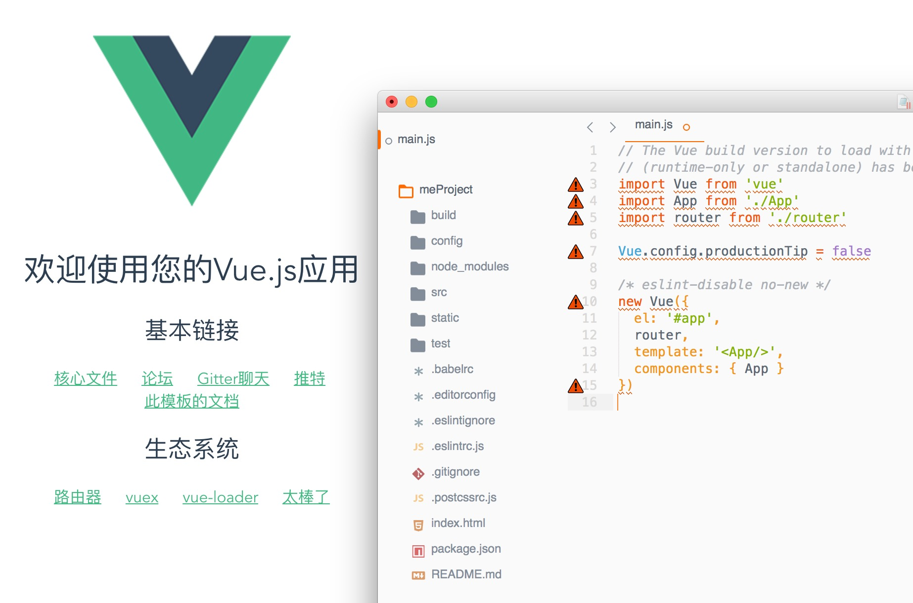
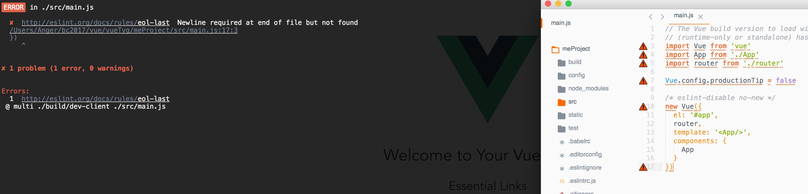
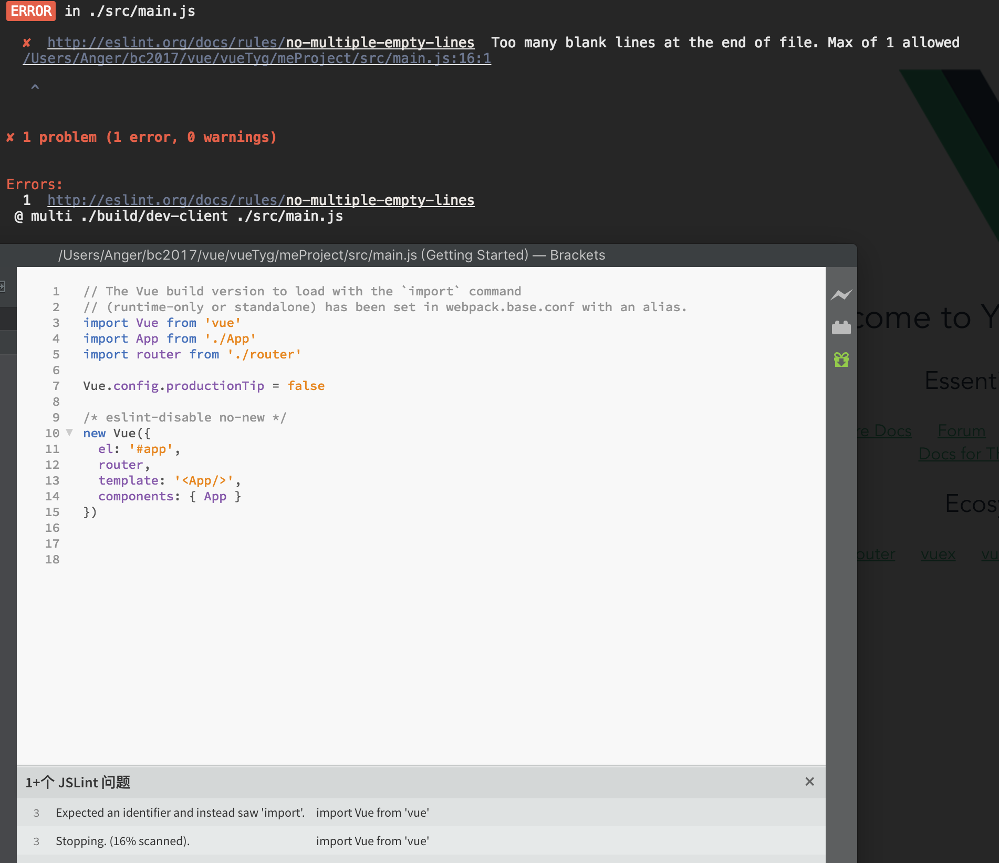

## 关于myProject 与meProject的说明
我在写「myProject」时，添加了注释，后来报错了，以为自己误改了内容，所以新创建了「meProject」，发现，原因并不是那么简单。

1. 使用 Submile Build3126 打开main.js是这样的

2. Command+S保存，就给我自动改变格式了，然后就报错了。
3. 原文可以看到16行有一个 空行，如果我在下面加一个17行没有事，如果有18行，就报错。

1. Vue更改格式报错，原因不明。
2. Sb在保存的时候会改变格式，原因不明。

